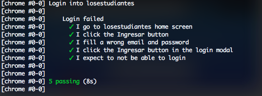

## Taller: BDD utilizando Cucumber

*Behavior-driven development* (BDD) es un proceso de desarrollo en el que se especifica el software a partir de su comportamiento. Esto permite integrar al proceso de desarrollo a los clientes activamente. *Test-driven development* es un factor importante para lograr este propósito, ya que permite que los requerimientos sean documentados en casos de prueba. Estos pueden ser documentados mediante *Specification by example*, una propuesta en la que las pruebas son escritas mediante ejemplos funcionales y útiles desde el punto de vista del cliente.

En este taller usaremos la herramienta  Cucumber que nos permite
especificar nuestras pruebas para aplicaciones web o móviles utilizando lenguaje informal (en inglés). Esto quiere decir que las pruebas pueden ser escritas por o junto a los stakeholders.

Las versiones de los sistemas operativos y programas utilizados para el desarrollo de este taller se muestran en la siguiente tabla:

| Programa/OS    | Versión   |
|----------------|---------- |
| Node           | 12.16.x    |
| Java           | 1.8.x     |
| NPM            | 6.13.x     |
| Android Studio | 3.5.3  |
| Mac OS         | 10.12.x |
| Ubuntu         | 16.04.x   |
| Windows        | 10        |
| Ruby           | 2.5.1     |

## 1. Cucumber

La primera herramienta que utilizaremos en este taller es [Cucumber](https://cucumber.io). Esta se encuentra implementada en varios lenguajes de programación y para este taller utilizaremos la versión en Javascript. La utilizaremos junto a Webdriver.io para poder manejar los eventos con el navegador como vimos en el taller 2.  

### 1.1 Especificación de la prueba

Empecemos por crear el archivo en el que realizaremos la prueba que hicimos sobre la página de [Los Estudiantes](https://losestudiantes.co) en el taller 2. Clone el repositorio que se encuentra [aquí](https://gitlab.com/miso-4208-labs/cucumber-webdriverio) e instale las dependencias con el siguiente comando en el terminal al nivel de la raíz del repositorio:

```bash
$ npm install
```

Dentro de la carpeta ``features`` complete el archivo ``login.feature`` de la siguiente manera:

```gherkin
Feature: Login into losestudiantes
    As an user I want to authenticate myself within losestudiantes website in order to rate teachers

Scenario: Login failed
    Given I go to losestudiantes home screen
    When I open the login screen
    And I fill a wrong email and password
    And I try to login
    Then I expect to not be able to login
```

La sintaxis es muy clara y hace uso de un lenguaje llamado **Gherkin**. [Aquí](https://cucumber.io/docs/reference) puede obtener más información sobre este.

## 1.2 Step Definitions

En el paso anterior vimos que las pruebas son muy fáciles de entender, pero ¿cómo pasamos de esto a código que se va a ejecutar sobre el navegador? Es ahí cuando los ``step-definitions`` entran en acción. Estos archivos sirven como un puente entre la especificación de nuestra prueba en los archivos ``.feature`` y webdriver.io. Diríjase al directorio ``step-definitions`` y complete el archivo ``index.js`` de la siguiente manera:

```javascript
var {Given} = require('cucumber');
var {When} = require('cucumber');
var {Then} = require('cucumber');
var {expect} = require('chai');

Given('I go to losestudiantes home screen', () => {
  browser.url('/uniandes/');
  if($('button=Cerrar').isDisplayed()) {
    $('button=Cerrar').click();
  }
});

When('I open the login screen', () => {
  $('button.loginButton').waitForExist(5000);
  $('button.loginButton').waitForDisplayed(5000);
  $('button.loginButton').click();
});

When('I fill a wrong email and password', () => {
  var cajaLogIn = $('.cajaLogIn');

  var mailInput = $('input[name="email"]');
  mailInput.click();
  mailInput.setValue('wrongemail@example.com');

  var passwordInput = $('input[name="password"]');
  passwordInput.click();
  passwordInput.setValue('123467891');
});

When('I try to login', () => {
  $('button=Ingresar').click();
});

Then('I expect to not be able to login', () => {
  $('.notice.alert.alert-danger').waitForDisplayed(5000);
});
```

Como puede ver, aquí definimos los pasos de nuestro *feature*. Lo bueno es que lo hacemos de una forma modular que nos permite reutilizar nuestros *steps* en otro escenarios de prueba. De hecho, [este repositorio](https://github.com/webdriverio/cucumber-boilerplate) cuenta con varios steps predefinidos para cubrir gran parte de las interacciones disponibles desde webdriver.io y así usted puede escribir directamente sus *features*.

## 1.3 Ejecución de las pruebas

Para ejecutar las pruebas ubíquese en su terminal en la raíz del repositorio y ejecute este comando:

```bash
$ npm test
```

Este fue el mismo alias que utilizamos en el taller5.md. Una vez haya terminando la ejecución usted verá este resultado en su terminal:

<p align="center">
    
</p>


## 1.4 Tablas de datos

El escenario anterior los podemos reescribir utilizando tablas de datos. Esto nos permite no tener que reescribir nuestro escenario para varios casos de datos fallidos a la hora de login. Reemplacé el código de su archivo ``features/login.feature`` por el siguiente:

```gherkin
Feature: Login into losestudiantes
    As an user I want to authenticate myself within losestudiantes website in order to rate teachers

Scenario Outline: Login failed with wrong inputs

  Given I go to losestudiantes home screen
    When I open the login screen
    And I fill with <email> and <password>
    And I try to login
    Then I expect to see <error>

    Examples:
      | email            | password | error                    |
      |                  |          | "Ingresa una contraseña"   |
      | miso@gmail.com   |    1234  | "Oops! Revisa tu contraseña"      |
```

Note que ahora estamos usando un *Scenario Outline* porque en este mismo vamos a hacer uso de ejemplos.

Como puede ver, en este caso definimos dos ejemplos distintos (login sin llenar campos y login con campos inválidos) en un solo escenario. Ahora modifiquemos las definiciones de los *steps* en el archivo ``features/step-definitions/index.js`` para que tenga en cuenta nuestra escenario con ejemplos. Agregue los siguientes métodos a dicho archivo dentro del bloque ``defineSupportCode``:

```javascript
When(/^I fill with (.*) and (.*)$/ , (email, password) => {
    
  
   var mailInput = $('input[name="email"]');
   mailInput.click();
   mailInput.keys(email);
  
   var passwordInput = $('input[name="password"]');
   passwordInput.click();
   passwordInput.keys(password)
});
  
Then('I expect to see {string}', error => {
   $('.notice.alert.alert-danger').waitForDisplayed(5000);
   var alertText = browser.$('.notice.alert.alert-danger').getText();
   expect(alertText).to.include(error);
});

```

Como puede ver, en el primero método hacemos uso de una expresión regular para definir cadenas con 0 o más caracteres para especificar los parámetros de email y password.

Vuelva a ejecutar la prueba como lo hizo en el numeral 1.4.

## 1.5 Su turno

* Complete el login-feature para tener en cuenta el caso de login exitoso. Recuerde añadir los steps necesarios en ``features/step-definitions/index.js``.
* Cree un nuevo feature describiendo en el feature de registro en los estudiantes. Su calificación dependerá de qué tantos escenarios haya tenido en cuenta.


### 1.6 Detalles de la entrega

Se debe entregar un archivo .zip con los archivos creados. El zip debe incluir un archivo README  con los detalles requeridos para la ejecución del código. La entrega se debe realizar a través de Coursera en las fechas indicadas.

### 1.7 Criterios de evaluación:

- El zip tiene un archivo README detallando la forma de ejecutar el código, y el zip  tiene el código solicitado. **[5 puntos]**

- El escenario es funcional, sigue la especificación dada, y no hay errores en el código. **[95 puntos]**

 **La evaluación tendrá en cuenta la inclusión de la totalidad de componentes solicitados y la calidad de cada uno de acuerdo con la rúbrica establecida.**
