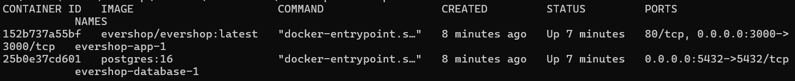
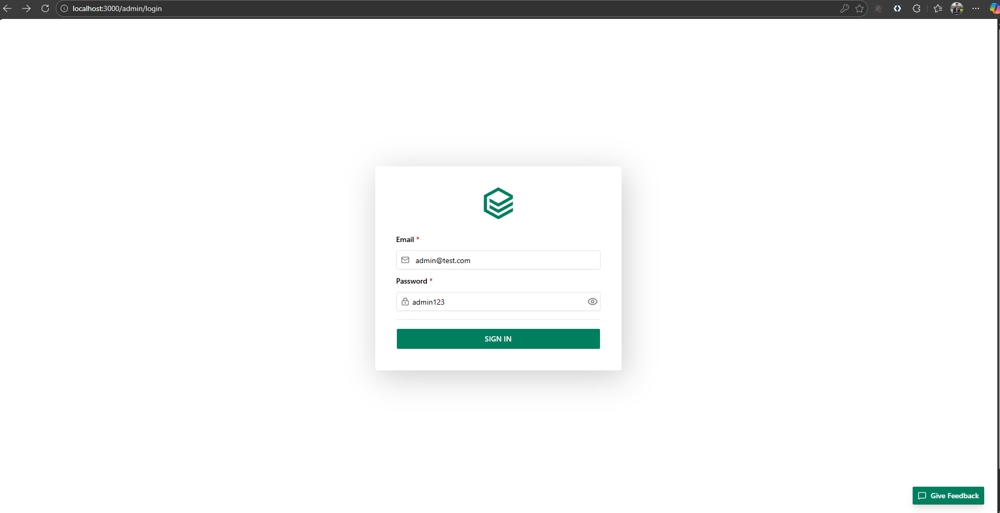

# Pruebas E2E con Cypress

Este taller está diseñado para explorar técnicas de pruebas automatizadas end-to-end (E2E) utilizando **Cypress** sobre una aplicación web de E-commerce real.

A través de esta actividad:

* Aprenderá a configurar Cypress en un proyecto independiente
* Implementará pruebas E2E reales sobre una aplicación web
* Practicará la selección de elementos, el manejo de formularios y navegación entre páginas

---

# 1. Preparación del Entorno

En esta parte prepararemos el entorno para poder realizar pruebas E2E sobre EverShop. Esta es una aplicación de E-commerce open source construida sobre TypeScript que permite diseñar y construir de manera sencilla tiendas online. Puede encontrar la documentación aquí: https://evershop.io/documentation

## 1.1 Levantar EverShop con Docker

Para poder hacer uso de EverShop, utilizaremos docker-compose el cual permite crear contenedores para ejecutar aplicaciones de manera sencilla.

Para empezar, cree un directorio para EverShop y descargue el archivo de configuración:

```bash
mkdir evershop-app
cd evershop-app
curl -sSL https://raw.githubusercontent.com/evershopcommerce/evershop/main/docker-compose.yml > docker-compose.yml
docker compose up -d
```

Por medio de estos comandos usted descargo el archivo `docker-compose.yml` y levanto dos contenedores: uno con la aplicación EverShop y otro con una base de datos PostgreSQL.

Luego de ello, verifique que los contenedores estén activos:

```bash
docker ps
```
Si todo salió bien debería observar algo como lo siguiente:



Como se puede apreciar en la imagen, la aplicación se levanta por defecto en el puerto 3000, y su base de datos en el puerto 5432. La aplicación estará disponible en:

```
http://localhost:3000
```

El panel del administrador en:

```
http://localhost:3000/admin
```

---

## 1.2 Crear usuario administrador

Para poder hacer uso de la aplicación es necesario crear un usuario administrador, para ello entre al contenedor:

```bash
docker exec -it evershop-app-1 sh
```

Ejecute el siguiente comando para crear un usuario:

```bash
npm run user:create -- --email admin@test.com --password admin123 --name "Admin"
```
---

Una vez creado el usuario administrador, ingrese a http://localhost:3000/admin e inicie sesión con el usuario y contraseña creado, es decir, admin@test.com - admin123


---

# 2. Configuración del Proyecto Cypress

Ahora crearemos un proyecto de Cypress desde cero para realizar las pruebas E2E sobre EverShop.

## 2.1 Crear el Proyecto

Cree un nuevo directorio para el proyecto de pruebas e inicialice un proyecto Node.js:

```bash
mkdir taller-cypress
cd taller-cypress
npm init -y
```

## 2.2 Inicialización de Cypress

Si ya cuenta con la instalación de Cypress global, puede iniciarlo directamente con

```bash
cypress open
```

Si no es así, puede instalar Cypress como dependencia de desarrollo:

```bash
npm install cypress --save-dev
```
He inicializarlo de la siguiente manera:

```bash
npx cypress open
```

Esto abrirá la interfaz gráfica de Cypress. Seleccione **E2E Testing** y luego elija un navegador para continuar. Cypress creará automáticamente la estructura de carpetas necesaria.

---

# 3. Configuración Inicial del Sistema

Antes de crear productos y realizar pruebas de checkout, es necesario configurar los métodos de pago y envío en EverShop.

## 3.1 Crear el Archivo de Configuración

Cree el archivo `cypress/e2e/admin-setup.cy.js` y copie el siguiente código:

```javascript
describe("Admin Panel - Initial Setup", () => {
  beforeEach(() => {
    // Login del administrador
    cy.visit("http://localhost:3000/admin/login");
    cy.get('input[name="email"]').type("admin@test.com");
    cy.get('input[name="password"]').type("admin123");
    cy.get('button[type="submit"]').click();
    cy.url().should("include", "/admin");
    cy.contains("Dashboard", { timeout: 10000 }).should("be.visible");
  });

  /**
   * Configurar métodos de pago y envío
   */
  it("configures store settings for checkout", () => {

    // Paso 1: Ir a Setting
    cy.contains("Setting").click();
    cy.contains("Store").click();
    cy.url().should("include", "/admin/setting/store");

    // Paso 2: Activar Cash on Delivery
    cy.contains("Payment").click();
    cy.url().should("include", "/admin/setting/payments");
    
    // Buscar Cash On Delivery y hacer click en el botón de settings
    cy.contains("Cash On Delivery", { timeout: 5000 }).should("be.visible");

    // Activar el switch de Cash on Delivery
    cy.get('span[role="switch"][aria-checked="false"]').eq(2).click();

    // Guardar
    cy.contains("button", "Save").click();
    cy.contains("Payment setting saved", { timeout: 10000 }).should("be.visible");

    // Paso 3: Configurar Shipping Zones y Methods
    cy.contains("Shipping").click();
    cy.url().should("include", "/admin/setting/shipping");

    // Click en "Create New Zone"
    cy.contains("button", "Create New Zone", { timeout: 5000 }).click();

    // Llenar el formulario del dialog de zona
    // Nombre de la zona
    cy.get('input[name="name"]').type("United States Zone");

    // Seleccionar país (United States)
    cy.get('input[id="field-country"]').click();
    cy.contains("United States", { timeout: 5000 }).click();

    // Seleccionar provincia (New York)
    cy.get('input[id="field-provinces"]').click();
    cy.contains("New York", { timeout: 5000 }).click();
    // Click fuera del dropdown para cerrarlo
    cy.get('input[name="name"]').click();

    // Guardar la zona
    cy.get('form[id="createShippingZone"]').within(() => {
      cy.contains("button", "Save").click();
    });

    // Paso 4: Agregar método de envío
    cy.contains("button", "+ Add Method", { timeout: 5000 }).click();

    // En el dialog de shipping method
    // Escribir nombre del método de envío (esto crea uno nuevo)
    cy.get('input[id="field-method_id"]').type("Standard Shipping{enter}");

    // Habilitar el método (activar switch de status)
    cy.get('form[id="shippingMethodForm"]').within(() => {
      cy.get('span[role="switch"][aria-checked="false"]').click();
    });

    // El radio "Flat rate" ya está seleccionado por defecto

    // Llenar el costo del envío
    cy.get('input[name="cost"]').clear().type("10.00");

    // Guardar el método de envío
    cy.get('form[id="shippingMethodForm"]').within(() => {
      cy.contains("button", "Save").click();
    });

    cy.contains("successfully", { timeout: 10000 }).should("be.visible");

    // Regresar al dashboard
    cy.contains("Dashboard").click();
    cy.url().should("include", "/admin");
  });
});
```

**¿Qué hace este test?**

Este test configura automáticamente:
1. Activa el método de pago "Cash on Delivery"
2. Crea una zona de envío para Estados Unidos (New York)
3. Crea un método de envío "Standard Shipping" con un costo de $10

**Importante:** Ejecute este test **UNA SOLA VEZ** antes de ejecutar los demás tests.

---

# 4. Implementación Base de la Prueba E2E

## 4.1 Crear el Archivo de Prueba Base

Ahora cree el archivo base del taller que contiene el login del administrador y la creación de un producto.

Cree el archivo `cypress/e2e/admin-product.cy.js` y copie el siguiente código:

```javascript
describe("Admin Panel - Product Management", () => {
  /**
   * Este beforeEach se ejecuta antes de cada test
   * Automatiza el login del administrador para que no tenga que repetir este código
   */
  beforeEach(() => {
    // Visitar la página de login del admin
    cy.visit("http://localhost:3000/admin/login");

    // Llenar el formulario de login
    cy.get('input[name="email"]').type("admin@test.com");
    cy.get('input[name="password"]').type("admin123");

    // Hacer click en el botón de login
    cy.get('button[type="submit"]').click();

    // Esperar a que la navegación al dashboard del admin sea exitosa
    cy.url().should("include", "/admin");
    cy.contains("Dashboard", { timeout: 10000 }).should("be.visible");
  });

  /**
   * Test completo: Crear un nuevo producto
   * Este test está implementado como referencia
   */
  it("creates a new product successfully", () => {
    // Navegar a la sección de productos
    cy.contains("Catalog").click();
    cy.contains("Products").click();
    cy.url().should("include", "/admin/products");

    // Click en crear nuevo producto
    cy.contains("button", "New Product", { timeout: 5000 }).click();

    // Llenar información básica del producto
    cy.get('input[name="name"]').type("Cypress Test Product");

    // Establecer precio
    cy.get('input[name="price"]').clear().type("99.99");

    // Establecer SKU (código único del producto)
    const uniqueSKU = `TEST-${Date.now()}`;
    cy.get('input[name="sku"]').type(uniqueSKU);

    // Establecer cantidad en stock
    cy.get('input[name="qty"]').clear().type("10");

    // Establecer Tax Class (combobox personalizado)
    cy.get('button[id="field-tax_class"]').click();
    cy.contains("Taxable Goods").click();

    // Establecer URL Key
    cy.get('input[name="url_key"]').type("cypress-test-product");

    // Establecer Meta Title
    cy.get('input[name="meta_title"]').type("Cypress Test Product");

    // Establecer Weight
    cy.get('input[name="weight"]').type("1.5");

    // Guardar el producto
    cy.contains("button", "Save").click();

    // Verificar que el producto fue creado exitosamente
    cy.contains("Product created successfully", { timeout: 10000 }).should(
      "be.visible"
    );

    // Hacer click en el botón de regresar a la lista de productos (breadcrumb)
    cy.get('a[href*="/admin/products"]').eq(2).click();

    // Verificar que estamos de vuelta en la lista de productos
    cy.url().should("include", "/admin/products");

    // Verificar que el producto aparece en la lista
    cy.contains("Cypress Test Product").should("be.visible");
  });
});
```

Este archivo sirve como **referencia** para entender cómo estructurar sus pruebas en Cypress. Adicional a ello puede consultar ejemplos de pruebas E2E con Cypress en el siguiente link: [Cypress Ghost Examples](https://github.com/TheSoftwareDesignLab/Software-engineering-examples/tree/main/Cypress-ghost-examples)

## 4.2 Ejecución del Código Base

Para ejecutar el test, abra Cypress:

```bash
npx cypress open
```

o si lo tiene instalado de manera global


```bash
cypress open
```

Luego seleccione el archivo `admin-product.cy.js` en la interfaz de Cypress. Debería ver cómo se ejecuta automáticamente el login y la creación del producto.

**Importante:** Asegúrese de que EverShop esté ejecutándose en `http://localhost:3000` antes de correr las pruebas.

---

# 5. Actividad

Ahora deberá crear un nuevo archivo llamado `customer-checkout.cy.js` dentro de la carpeta `cypress/e2e/` que implemente el **flujo completo de compra desde la perspectiva del cliente**.

## 5.1 Especificación del Test

Su archivo debe incluir:

1. **Un `beforeEach()`** que:
   - Visite el storefront (homepage) en `http://localhost:3000`
   - Espere a que la página cargue correctamente

2. **Un test que ejecute los siguientes pasos secuencialmente**:
   - Hacer click en el botón de búsqueda (Search) en la página principal
   - Escribir "Cypress Test Product" en la barra de búsqueda que se abre
   - Hacer click en el producto que aparece en los resultados
   - Agregar el producto al carrito
   - Navegar al carrito
   - Proceder al checkout
   - Llenar el formulario de checkout con información del cliente:
     - Email
     - Nombre completo
     - Dirección de envío
     - Ciudad
     - Código postal
     - País
   - Verificar que se llegó a la página de confirmación o pago


# 6. Detalles de la Entrega

Se debe entregar un archivo **.zip** con los siguientes archivos:

- La carpeta `cypress/e2e/` con ambos archivos de prueba:
  - `admin-product.cy.js` (sin modificaciones)
  - `customer-checkout.cy.js` (su implementación)
- El archivo `package.json` (generado automáticamente al hacer `npm init -y`). **NO** incluya el `package-lock.json` ni el directorio `node_modules`
- Un archivo `README.md` con:
  - Los pasos para instalar Cypress
  - Las instrucciones para ejecutar las pruebas
  - Cualquier consideración adicional sobre su implementación
  - Capturas de pantalla o descripción de las pruebas ejecutándose exitosamente

---

# 7. Criterios de Evaluación

- El zip tiene un archivo README completo y el código está correctamente estructurado. **[10 puntos]**
- El archivo `customer-checkout.cy.js` implementa correctamente el flujo especificado usando la API de Cypress. **[40 puntos]**
- Las pruebas son funcionales, manejan errores apropiadamente y siguen las mejores prácticas de Cypress. **[30 puntos]**
- El test es independiente y no depende de ejecuciones previas. **[20 puntos]**

**La evaluación tendrá en cuenta la inclusión de la totalidad de componentes solicitados y la calidad de cada uno de acuerdo con la rúbrica establecida.**

---
