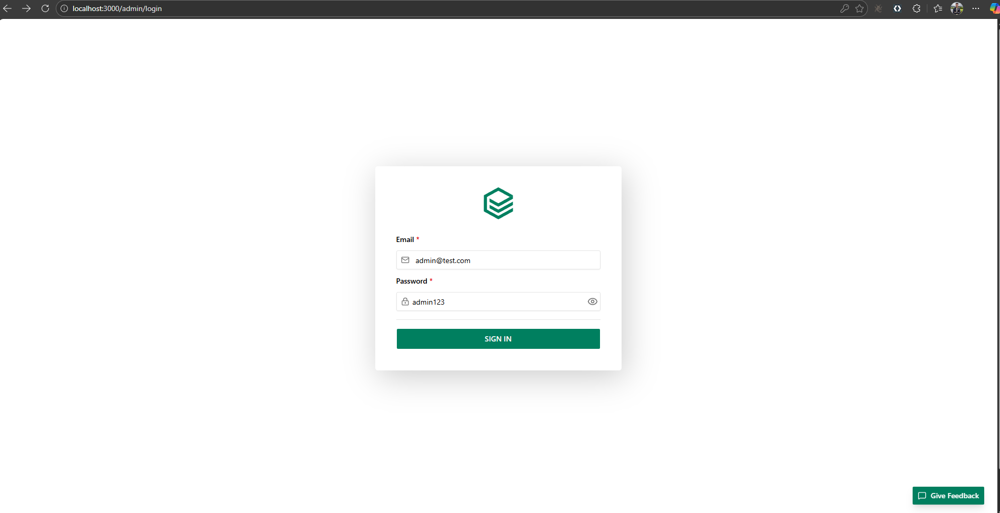

# Pruebas E2E con Cypress

Este taller está diseñado para explorar técnicas de pruebas automatizadas end-to-end (E2E) utilizando **Cypress** sobre una aplicación web de E-commerce real.

A través de esta actividad:

* Aprenderá a configurar Cypress en un proyecto independiente
* Implementará pruebas E2E reales sobre una aplicación web
* Practicará la selección de elementos, el manejo de formularios y navegación entre páginas

---

# 1. Preparación del Entorno

Requisito: el [Taller 0](../evershop) (repositorio de talleres instalado y EverShop en ejecución). EverShop
queda disponible en `http://localhost:3000` y su administración en `http://localhost:3000/admin`,
con el usuario `admin@test.com` y la contraseña `admin123`.



---

# 2. Configuración del Proyecto Cypress

El taller está en `talleres/e2e-cypress/` de su repositorio. Cypress es una dependencia del
proyecto, no una instalación global.

| Archivo | Contenido |
|---|---|
| `package.json` | Dependencia de Cypress y scripts del taller |
| `cypress.config.js` | Configuración de Cypress |
| `scripts/evaluate.js` | Ejecución de las pruebas para la evaluación |
| `cypress/e2e/admin-setup.cy.js`, `cypress/e2e/admin-product.cy.js` | Pruebas base (secciones 3 y 4) |
| `cypress/e2e/customer-checkout.cy.js` | Prueba de la actividad, por implementar (sección 5) |
| `README.md` | Secciones que debe completar |

**`talleres/e2e-cypress/package.json`**

```json
{
  "name": "taller-e2e-cypress",
  "private": true,
  "type": "module",
  "engines": {
    "node": ">=24"
  },
  "scripts": {
    "setup": "cypress install",
    "cypress": "cypress open",
    "evaluate": "node scripts/evaluate.js"
  },
  "devDependencies": {
    "cypress": "~16.1.1"
  },
  "allowScripts": {
    "cypress": true
  }
}
```

`baseUrl` toma la URL de la tienda de la variable `BASE_URL`, por lo que las pruebas usan rutas
relativas (`cy.visit("/admin/login")`):

**`talleres/e2e-cypress/cypress.config.js`**

```javascript
import { defineConfig } from "cypress";

export default defineConfig({
  e2e: {
    baseUrl: process.env.BASE_URL ?? "http://localhost:3000",
    screenshotsFolder: "results/screenshots",
    supportFile: false,
    video: false,
  },
});
```

`npm run evaluate` ejecuta las pruebas una por una, en el orden en que dependen entre sí, y escribe
`results/summary.json`:

**`talleres/e2e-cypress/scripts/evaluate.js`**

```javascript
// Runs the specs one at a time, in this order, against a store reset by `npm run app:reset`:
// customer-checkout needs the product and the store settings that the admin specs create.
import { existsSync } from "node:fs";
import { mkdir, writeFile } from "node:fs/promises";
import cypress from "cypress";

const specs = ["admin-setup", "admin-product", "customer-checkout"]
  .map((name) => `cypress/e2e/${name}.cy.js`)
  .filter((spec) => existsSync(spec));

const results = [];
for (const spec of specs) {
  const run = await cypress.run({ spec, quiet: true });
  if (run.status === "failed") {
    results.push({ spec, error: run.message });
  } else {
    results.push({
      spec,
      tests: run.totalTests,
      passed: run.totalPassed,
      failed: run.totalFailed,
      pending: run.totalPending,
    });
  }
}

const failed = results.filter((result) => result.error || result.failed > 0);
await mkdir("results", { recursive: true });
await writeFile("results/summary.json", `${JSON.stringify({ specs: results }, null, 2)}\n`);
console.log(results);
process.exit(failed.length === 0 ? 0 : 1);
```

---

# 3. Configuración Inicial del Sistema

Antes de crear productos y realizar pruebas de checkout, es necesario configurar los métodos de pago y envío en EverShop.

## 3.1 Crear el Archivo de Configuración

El archivo `cypress/e2e/admin-setup.cy.js` contiene el siguiente código:

**`talleres/e2e-cypress/cypress/e2e/admin-setup.cy.js`**

```javascript
describe("Admin Panel - Initial Setup", () => {
  beforeEach(() => {
    // Login del administrador
    cy.visit("/admin/login");
    cy.get('input[name="email"]').type("admin@test.com");
    cy.get('input[name="password"]').type("admin123");
    cy.get('button[type="submit"]').click();
    cy.url().should("include", "/admin");
    cy.contains("Dashboard", { timeout: 10000 }).should("be.visible");
  });

  /**
   * Configurar métodos de pago y envío
   */
  it("configures store settings for checkout", () => {

    // Paso 1: Ir a Setting
    cy.contains("Setting").click();
    cy.contains("Store").click();
    cy.url().should("include", "/admin/setting/store");

    // Paso 2: Activar Cash on Delivery
    cy.contains("Payment").click();
    cy.url().should("include", "/admin/setting/payments");
    
    // Buscar Cash On Delivery y hacer click en el botón de settings
    cy.contains("Cash On Delivery", { timeout: 5000 }).should("be.visible");

    // Activar el switch de Cash on Delivery
    cy.get('span[role="switch"][aria-checked="false"]').eq(2).click();

    // Guardar
    cy.contains("button", "Save").click();
    cy.contains("Payment setting saved", { timeout: 10000 }).should("be.visible");

    // Paso 3: Configurar Shipping Zones y Methods
    cy.contains("Shipping").click();
    cy.url().should("include", "/admin/setting/shipping");

    // Click en "Create New Zone"
    cy.contains("button", "Create New Zone", { timeout: 5000 }).click();

    // Llenar el formulario del dialog de zona
    // Nombre de la zona
    cy.get('input[name="name"]').type("United States Zone");

    // Seleccionar país (United States)
    cy.get('input[id="field-country"]').click();
    cy.contains("United States", { timeout: 5000 }).click();

    // Seleccionar provincia (New York)
    cy.get('input[id="field-provinces"]').click();
    cy.contains("New York", { timeout: 5000 }).click();
    // Click fuera del dropdown para cerrarlo
    cy.get('input[name="name"]').click();

    // Guardar la zona
    cy.get('form[id="createShippingZone"]').within(() => {
      cy.contains("button", "Save").click();
    });

    // Paso 4: Agregar método de envío
    cy.contains("button", "+ Add Method", { timeout: 5000 }).click();

    // En el dialog de shipping method
    // Escribir nombre del método de envío (esto crea uno nuevo)
    cy.get('input[id="field-method_id"]').type("Standard Shipping{enter}");

    // Habilitar el método (activar switch de status)
    cy.get('form[id="shippingMethodForm"]').within(() => {
      cy.get('span[role="switch"][aria-checked="false"]').click();
    });

    // El radio "Flat rate" ya está seleccionado por defecto

    // Llenar el costo del envío
    cy.get('input[name="cost"]').clear().type("10.00");

    // Guardar el método de envío
    cy.get('form[id="shippingMethodForm"]').within(() => {
      cy.contains("button", "Save").click();
    });

    cy.contains("successfully", { timeout: 10000 }).should("be.visible");

    // Regresar al dashboard
    cy.contains("Dashboard").click();
    cy.url().should("include", "/admin");
  });
});
```

**¿Qué hace este test?**

Este test configura automáticamente:
1. Activa el método de pago "Cash on Delivery"
2. Crea una zona de envío para Estados Unidos (New York)
3. Crea un método de envío "Standard Shipping" con un costo de $10

**Importante:** este test modifica la configuración de la tienda, por lo que se ejecuta **una sola vez** sobre una tienda recién reiniciada (`npm run app:reset`) y antes que los demás. `npm run evaluate` lo hace en ese orden.

---

# 4. Implementación Base de la Prueba E2E

## 4.1 Crear el Archivo de Prueba Base

Ahora cree el archivo base del taller que contiene el login del administrador y la creación de un producto.

El archivo `cypress/e2e/admin-product.cy.js` contiene el siguiente código:

**`talleres/e2e-cypress/cypress/e2e/admin-product.cy.js`**

```javascript
describe("Admin Panel - Product Management", () => {
  /**
   * Este beforeEach se ejecuta antes de cada test
   * Automatiza el login del administrador para que no tenga que repetir este código
   */
  beforeEach(() => {
    // Visitar la página de login del admin
    cy.visit("/admin/login");

    // Llenar el formulario de login
    cy.get('input[name="email"]').type("admin@test.com");
    cy.get('input[name="password"]').type("admin123");

    // Hacer click en el botón de login
    cy.get('button[type="submit"]').click();

    // Esperar a que la navegación al dashboard del admin sea exitosa
    cy.url().should("include", "/admin");
    cy.contains("Dashboard", { timeout: 10000 }).should("be.visible");
  });

  /**
   * Test completo: Crear un nuevo producto
   * Este test está implementado como referencia
   */
  it("creates a new product successfully", () => {
    // Navegar a la sección de productos
    cy.contains("Catalog").click();
    cy.contains("Products").click();
    cy.url().should("include", "/admin/products");

    // Click en crear nuevo producto
    cy.contains("button", "New Product", { timeout: 5000 }).click();

    // Llenar información básica del producto
    cy.get('input[name="name"]').type("Cypress Test Product");

    // Establecer precio
    cy.get('input[name="price"]').clear().type("99.99");

    // Establecer SKU (código único del producto)
    const uniqueSKU = `TEST-${Date.now()}`;
    cy.get('input[name="sku"]').type(uniqueSKU);

    // Establecer cantidad en stock
    cy.get('input[name="qty"]').clear().type("10");

    // Establecer Tax Class (combobox personalizado)
    cy.get('button[id="field-tax_class"]').click();
    cy.contains("Taxable Goods").click();

    // Establecer URL Key
    cy.get('input[name="url_key"]').type("cypress-test-product");

    // Establecer Meta Title
    cy.get('input[name="meta_title"]').type("Cypress Test Product");

    // Establecer Weight
    cy.get('input[name="weight"]').type("1.5");

    // Guardar el producto
    cy.contains("button", "Save").click();

    // Verificar que el producto fue creado exitosamente
    cy.contains("Product created successfully", { timeout: 10000 }).should(
      "be.visible"
    );

    // Hacer click en el botón de regresar a la lista de productos (breadcrumb)
    cy.get('a[href*="/admin/products"]').eq(2).click();

    // Verificar que estamos de vuelta en la lista de productos
    cy.url().should("include", "/admin/products");

    // Verificar que el producto aparece en la lista
    cy.contains("Cypress Test Product").should("be.visible");
  });
});
```

Este archivo sirve como **referencia** para entender cómo estructurar sus pruebas en Cypress. Adicional a ello puede consultar ejemplos de pruebas E2E con Cypress en el siguiente link: [Cypress Ghost Examples](https://github.com/TheSoftwareDesignLab/Software-engineering-examples/tree/main/Cypress-ghost-examples)

## 4.2 Ejecución del Código Base

Abra la interfaz de Cypress desde `talleres/e2e-cypress/`:

```bash
npm run cypress
```

Seleccione **E2E Testing**, un navegador y luego el archivo `admin-product.cy.js`. Debería ver cómo se
ejecuta automáticamente el login y la creación del producto.

**Importante:** Asegúrese de que EverShop esté ejecutándose (`npm run app:up` desde la raíz del
repositorio) antes de correr las pruebas.

---

# 5. Actividad

Ahora deberá implementar en `cypress/e2e/customer-checkout.cy.js` (que hoy contiene una prueba pendiente) el **flujo completo de compra desde la perspectiva del cliente**.

## 5.1 Especificación del Test

Su archivo debe incluir:

1. **Un `beforeEach()`** que:
   - Visite la página de inicio de la tienda (`cy.visit("/")`)
   - Espere a que la página cargue correctamente

2. **Un test que ejecute los siguientes pasos secuencialmente**:
   - Hacer click en el botón de búsqueda (Search) en la página principal
   - Escribir "Cypress Test Product" en la barra de búsqueda que se abre
   - Hacer click en el producto que aparece en los resultados
   - Agregar el producto al carrito
   - Navegar al carrito
   - Proceder al checkout
   - Llenar el formulario de checkout con información del cliente:
     - Email
     - Nombre completo
     - Dirección de envío
     - Ciudad
     - Código postal
     - País
   - Verificar que se llegó a la página de confirmación o pago


# 6. Detalles de la Entrega

Cree el _tag_ `taller-e2e-cypress` sobre el _commit_ que se debe evaluar y súbalo a su repositorio
(`git push origin taller-e2e-cypress`). En ese _commit_, `talleres/e2e-cypress/` debe contener:

- La carpeta `cypress/e2e/` con los archivos de prueba:
  - `admin-setup.cy.js` y `admin-product.cy.js` (sin modificaciones)
  - `customer-checkout.cy.js` (su implementación)
- `package.json`, `package-lock.json`, `cypress.config.js` y `scripts/evaluate.js`.
- El archivo `README.md` con sus secciones completas:
  - Las instrucciones para ejecutar las pruebas
  - Cualquier consideración adicional sobre su implementación
  - Capturas de pantalla o descripción de las pruebas ejecutándose exitosamente

El equipo docente ejecutará `npm run evaluate -- e2e-cypress` desde la raíz del repositorio.

---

# 7. Criterios de Evaluación

- La entrega tiene un archivo README completo y el código está correctamente estructurado. **[10 puntos]**
- El archivo `customer-checkout.cy.js` implementa correctamente el flujo especificado usando la API de Cypress. **[40 puntos]**
- Las pruebas son funcionales, manejan errores apropiadamente y siguen las mejores prácticas de Cypress. **[30 puntos]**
- El test es independiente y no depende de ejecuciones previas. **[20 puntos]**

**La evaluación tendrá en cuenta la inclusión de la totalidad de componentes solicitados y la calidad de cada uno de acuerdo con la rúbrica establecida.**

---
