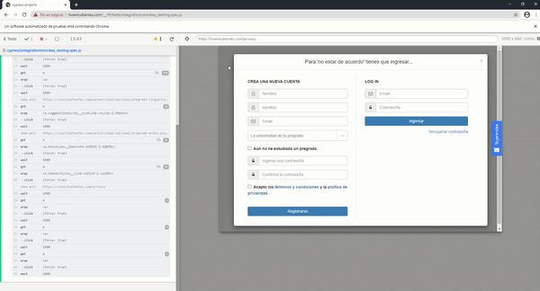

# Taller: Random testing en Aplicaciones Web

La idea de este taller es explorar los conceptos para realizar *monkey testing* en el navegador-

## 1. Monkey con Cypress.io

En esta parte desarrollaremos nuestro propio *Monkey* que visitará la página de [losestudiantes](https://losestudiantes.co), buscará todos los links y hará click en uno de ellos al azar. Esto se repetirá hasta que un cierto número de links hayan sido clickeados.

### 1.1 Haciendo click en un link al azar de la página

Comencemos por crear nuestro archivo de pruebas Cypress.io. Cree un nuevo directorio vacío, abra Cypress.io, haga click en Add Project y seleccione el directorio creado. Ahora, desde la interfaz de Cypress, abra el nuevo proyecto y verá un modal diciéndole que los archivos de configuración y una prueba de ejemplo han sido creados. Desde el directorio del proyecto en su explorador de archivos, diríjase a la carpeta ``cypress/e2e`` creada por Cypress.io (en caso de no encontrar la carpeta, deberá crearla manualmente), y proceda a crear un nuevo archivo llamado ``monkey_testing.cy.js`` (borre todos demás archivos ``cypress/e2e/*.cy.js``). El contenido del archivo ``monkey_testing.cy.js`` es el siguiente:

```javascript
describe('Los estudiantes under monkeys', function() {
    it('visits los estudiantes and survives monkeys', function() {
        cy.visit('https://losestudiantes.co');
        cy.wait(1000);
        randomClick(10);
    })
})
function randomClick(monkeysLeft) {

    function getRandomInt(min, max) {
        min = Math.ceil(min);
        max = Math.floor(max);
        return Math.floor(Math.random() * (max - min)) + min;
    };

    var monkeysLeft = monkeysLeft;
    if(monkeysLeft > 0) {
        cy.get('a').then($links => {
            var randomLink = $links.get(getRandomInt(0, $links.length));
            if(!Cypress.dom.isHidden(randomLink)) {
                cy.wrap(randomLink).click({force: true});
                monkeysLeft = monkeysLeft - 1;
            }
            cy.wait(1000);
            randomClick(monkeysLeft);
        });
    }   
}
```

En el método ``randomClick`` es donde hacemos click en un link al azar. Comenzamos por buscar todos los links de la página actual usando el método [cy.get](https://docs.cypress.io/api/commands/get.html#Syntax) de Cypress, y luego usamos el método [.then](https://docs.cypress.io/api/commands/then.html) para obtener una promesa con el elemento html y poder trabajar con este. Ahora, teniendo la lista de todos los links, podemos seleccionar un link al azar. Luego, con el método [isHidden](https://docs.cypress.io/api/cypress-api/dom.html#Syntax), miramos si el link no esta escondido, y en dado caso, hacemos click en él. Para volver a obtener un elemento de Cypress a partir del link al azar (randomLink), hacemos uso del método [wrap](https://docs.cypress.io/api/commands/wrap.html). Ahora dele un vistazo a la opción que pasamos por parámetro al método [click](https://docs.cypress.io/api/commands/click.html#Events). Esta opción, nos permite saltarnos las validaciones de Cypress.io mencionadas en este [enlace](https://docs.cypress.io/guides/core-concepts/interacting-with-elements.html#Actionability), para que podamos realizar click en eventos escondidos, aunque sean inválidos. Luego, después de 1 segundo, volvemos a llamar a la misma función con el número de monkeys actualizado.

En el bloque ``describe`` al inicio del archivo es donde definimos nuestra prueba. Lo que hacemos es quitar el modal inicial haciendo click en el botón Cerrar y luego llamamos a nuestro método ``randomClick`` con 10 monkeys.

### 1.2 Ejecutar la prueba

Guarde el archivo ``monkey_testing.cy.js``, y desde la interfaz de Cypress.io, láncelo haciendo click en él. Usted verá la prueba correr de una manera similar a esta:



Si hay un error al ejecutar la prueba, no se alarme. Habrá veces en la que Cypress no logrará hacer click en un elemento seleccionado al azar. Esto es normal, ya que el elemento pudo haber desaparecido de la página.

### 1.3 Su turno

Ahora usted deberá crear una nueva función ``randomEvent()`` que toma por parámetro la cantidad de eventos que se desean lanzar secuencialmente al igual que el método ``randomClick`` y debe:

* Seleccionar un evento al azar entre estos:
    * Hacer click en un link al azar
    * Llenar un campo de texto al azar
    * Seleccionar un combo al azar
    * Hacer click en un botón al azar
* Realizar el evento
* Hacer un llamado recursivo a esta misma función hasta que no queden más monkeys.

**Aclaración:** El evento al azar es seleccionado por la **función**, no por usted.

### 1.4 Detalles de la entrega

Se debe entregar un archivo .zip con los archivos creados. El zip debe incluir un archivo README  con los detalles requeridos para la ejecución del código. La entrega se debe realizar a través de Coursera en las fechas indicadas.

### 1.5 Criterios de evaluación:

- El zip tiene un archivo README detallando la forma de ejecutar el código, y el zip  tiene el código solicitado. **[5 puntos]**
- El método ``randomEvent()`` funciona de acuerdo con la especificación dada. **[45 puntos]**
- El monkey es funcional y no hay errores en el código. **[50 puntos]**

 **La evaluación tendrá en cuenta la inclusión de la totalidad de componentes solicitados y la calidad de cada uno de acuerdo con la rúbrica establecida.**
