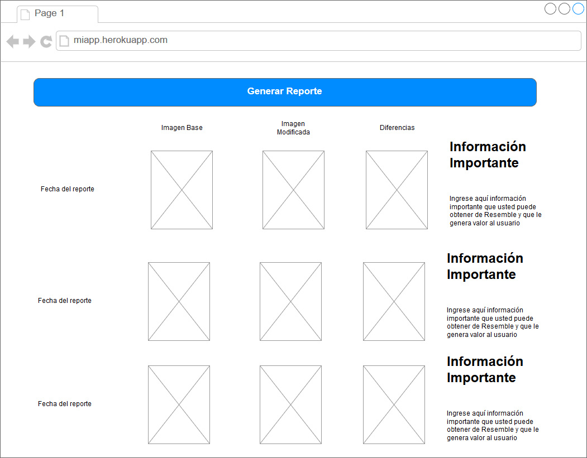

# Taller: Visual Regression Testing utilizando Resemble JS

_Visual Regression Testing_ es una rama de pruebas de regresión en la cual el sujeto de estudio es la interfaz grafica. Esto permite realizar estudios de los efectos que tienen los cambios en interfaz con respecto a versiones anteriores. En este taller exploraremos este tipo de pruebas haciendo uso de [ResembleJS](http://rsmbl.github.io/Resemble.js/).

Para este taller usted debe:

1. Crear la aplicación a probar.
2. Manejar Cypress para tomar _screenshots_
3. Usar [ResembleJS](https://github.com/rsmbl/Resemble.js) para comparar los _screenshots_ tomados.
4. Generar un script que automaticamente realice el proceso realizado en los puntos 2 y 3, con tal de generar un reporte.

## Entregable

Este taller se divide en 4 fases que le llevaran a poder completar una solución de pruebas automaticas que le podría ser util para su proyecto. Al finalizar el taller usted debe entregar un documento donde se evidencie:

1. Link al repositorio del código de la primera fase del taller
2. Link a la página publicada de su aplicación de la primera fase funcionando. Esto lo puede hacer en github pages o gitlab pages ya que la aplicación solo tiene HTML, CSS y JS.
3. Los pantallazos obtenidos haciendo uso de Cypress.
4. Las respuestas a las preguntas planteadas en la tercer fase del taller.
5. Link al repositorio de su aplicación de automatización.
6. Reporte del funcionamiento de su aplicación desplegada.

## Crear la aplicación a probar.

Usted debe implementar una página HTML que genere paletas de colores aleatorias usando una armonía con 5 colores complementarios/equidistantes. Una estrategia para generar N colores complementarios es cambiar la tonalidad (hue) en la escala HSB/HSV de tal forma que la totalidad de la escala se divide en las mismas proporciones. Es decir, la tonalidad en HSB/HSV varía de 0 a 359 grados (escala entera), con 0 = rojo, 120 = verde, 240 = azul. Por ejemplo, una armonía equidistante con 20 colores tendrá una diferencia de tono de 360/20 entre cada color, manteniendo la misma saturación (S) y brillo (B); **Para este taller usted no debe modificar la saturación y el brillo salvo que tenga tiempo y quiera implementar un segundo esquema de generación de paleta (BONO)**. Ahora, para generación aleatoria de paletas se puede escoger un punto de inicio (e.j., 40 grados) y seleccionar los colores usando la diferencia tonal a partir de ese punto de inicio.

**Nota:** Tenga cuidado por que la escala de tonalidad va de 0 a 359.

Para efectos del taller se le proporcionara un [proyecto base](https://gitlab.com/miso-4208-labs/VRT_colorPallete) con lo siguiente:
- palette.html: página HTML que sirve como vista. Puede cambiar la apariencia visual si tiene tiempo. Note que el archivo ya tiene enlazado el archivo JS remoto de JQuery
- styles.css: hoja de estilos de palette.html
- color.js: librería JS para transformación entre escala de colores. Para generar armonías en HSB/HSV, es necesario contar con métodos de transformación en las esclas de RGB y hacia RGB. Estos le son proporcionados en este archivo.
- Script.js: archivo JS en el cual usted debe agregar sus funciones para generación de las paletas y manipulación de palette.html

En resumen, usted debe tener una página HTML que genera paletas aleatorias con 5 colores. Los colores se deben ver visualmente en la página, y se deben generar las reglas css para los colores ( se deben mostrar en el textarea ). Adicionalmente, el usuarió podrá limpiar la paleta cuando desee.

Una vez finalizada, suba su resultado a un repositorio y publique el resultado en la solución propuesta por su herramienta de trabajo colaborativo (Github Pages, Gitlab Pages, Bitbucket Pages)

## Manejar Cypress para tomar _screenshots_

Como parte de las amplias posibilidades de interacción con las que cuenta Cypress, podemos encontrar el comando ```cy.screenshot()``` este comando nos va a permitir guardar un screenshot del estado de la pantalla cuando se hace el llamado de la instrucción. Retome su taller 2 y modifique 3 de las pruebas con tal de tomar screenshots al inicio y final de cada prueba. Revise la [documentación](https://docs.cypress.io/api/commands/screenshot.html#Syntax) para mayor información.

**Reflexión:** Ve usted algún problema con los screenshots tomados por Cypress al intentar hacer _Visual Regression Testing_ ? Agregue su respuesta al documento de la entrega.

## Usar ResembleJS para comparar los _screenshots_ tomados

ResembleJS es una herramienta que nos permite analizar y comparar imagenes haciendo uso de HTML y JS. Su objetivo en esta parte del taller es revisar con detenimiento la documentación y responder las siguientes preguntas:

- ¿Qué información puedo obtener de una imagen al usar resembleJS y que significado tiene cada uno de los componentes de la respuesta?.
- ¿Qué información puedo obtener al comparar dos imagenes?
- ¿Qué opciones se pueden seleccionar al realizar la comparación ?

Ahora que conoce las funcionalidades de ResembleJS haremos nuestras primeras pruebas del uso de esta. Cree un proyecto NodeJS y compare las imagenes que obtuvo del punto anterior para cada prueba. Es decir, compare la imagen de antes de ejecutar la prueba con la posterior a la prueba y muestre los resultados obtenidos para las 3 pruebas. Use el filtro ```ignoreLess``` para las pruebas.

## Herramienta de automatización de Visual Regression Testing.

En este parte del taller usted debera crear una solución en el lenguaje que desee en la cual proporcione un mecanismo de ejecución de pruebas de regresión visual automaticamente para la aplicación que hizo en la primera fase. Se espera que su solución presente un resultado similar a la siguiente imagen:



En la cual cada vez que el usuario haga click en el boton, su solución ingrese al sitio que desplego en la primer fase, genere una paleta de colores, tome un screenshot, genere una segunda paleta de colores, tome otro screenshot, realice una comparación haciendo uso de ResembleJS y genere una nueva fila al principio donde se muestren los resultados de la prueba junto con información adicional que usted crea útil.

## Reporte de funcionamiento

Realice una bitacora del funcionamieto de su herramienta, se espera que presente screenshots de su herramienta y un gif de la aplicación en funcionamiento. Este reporte puede ser entregado por medio de una wiki/gitpages/gitbook o plataforma que le permita presentar contenido multimedia como el gif.


### Detalles de la entrega

Se debe entregar un archivo .zip con los archivos creados. El zip debe incluir un archivo README  con los detalles requeridos para la ejecución del código. La entrega se debe realizar a través de Coursera en las fechas indicadas.

### Criterios de evaluación:

- El zip tiene un archivo README detallando la forma de ejecutar el código, y el zip  tiene el código solicitado. **[5 puntos]**

- El escenario es funcional, sigue la especificación dada, y no hay errores en el código. **[95 puntos]**

 **La evaluación tendrá en cuenta la inclusión de la totalidad de componentes solicitados y la calidad de cada uno de acuerdo con la rúbrica establecida.**
